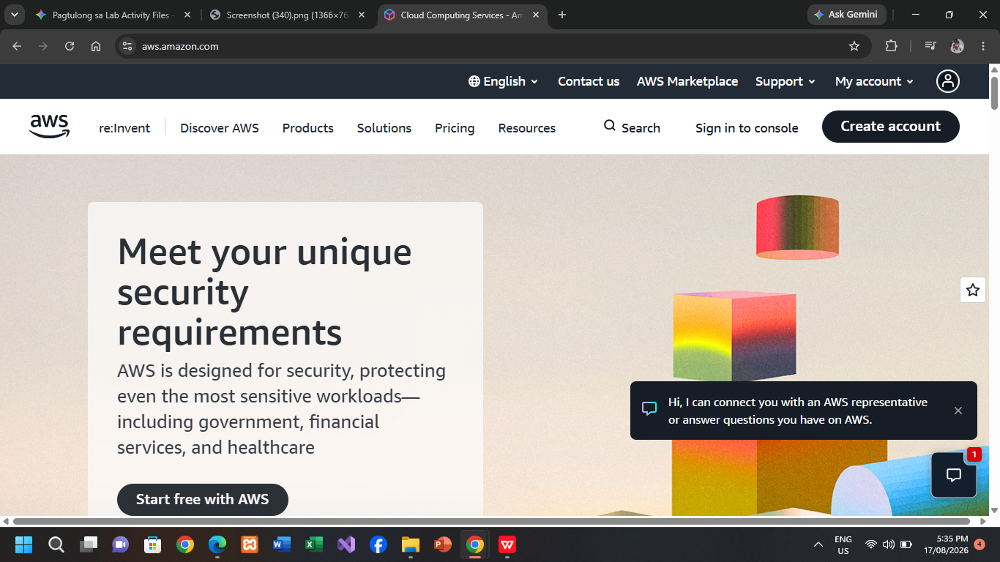

# AWS Research Document

## Brief Overview
Amazon Web Services (AWS) is a comprehensive and broadly adopted cloud platform provided by Amazon, offering over 200 fully featured services from data centers globally.

## Global Infrastructure
AWS global infrastructure is built around AWS Regions and Availability Zones (AZs). An AWS Region is a physical location in the world with multiple isolated and physically separate Availability Zones connected by low-latency networking.

## Cloud Management Console
The AWS Management Console is a web-based interface that allows users to access, manage, and monitor all AWS cloud resources in a secure and centralized hub.

## Core Services
1. **Amazon EC2 (Elastic Compute Cloud):** Provides scalable virtual servers in the cloud.
2. **Amazon S3 (Simple Storage Service):** Industry-leading scalable object storage service.
3. **Amazon VPC (Virtual Private Cloud):** Logically isolated virtual network for cloud resources.
4. **AWS IAM (Identity and Access Management):** Controls access to AWS services and resources securely.

## Advantages
1. **Market Leadership & Broad Capabilities:** Widest selection of services and highest maturity.
2. **Extensive Global Infrastructure:** Massive footprint of regions and redundancy.
3. **Robust Ecosystem:** Vast partner network, deep documentation, and huge user community.

## Typical Enterprise Use Cases
- Large-scale enterprise migrations.
- High-traffic global e-commerce applications needing dynamic auto-scaling.
- Massive data analytics pipelines and data lakes.

