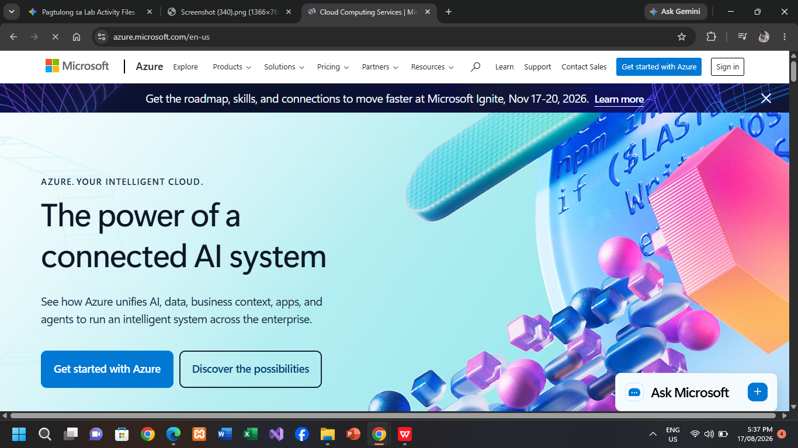

# Microsoft Azure Research Document

## Brief Overview
Microsoft Azure is a cloud computing service created by Microsoft for building, testing, deploying, and managing applications through Microsoft-managed data centers.

## Global Infrastructure
Azure has more global regions than any other cloud provider, delivering regional redundancy, disaster recovery, and geographic connectivity to preserve data compliance and latency needs.

## Cloud Management Console
The Azure Portal is a unified web-based graphical console that simplifies resource provisioning, billing management, and cross-resource monitoring.

## Core Services
1. **Azure Virtual Machines:** On-demand scalable compute resources.
2. **Azure Blob Storage:** Massively scalable object storage for unstructured data.
3. **Azure Virtual Network (VNet):** Fundamental network environment for private cloud resources.
4. **Microsoft Entra ID (formerly Azure Active Directory):** Universal cloud-based identity and access management platform.

## Advantages
1. **Seamless Microsoft Ecosystem Integration:** Native synergy with Active Directory, Windows Server, and M365.
2. **Strong Hybrid Cloud Infrastructure:** Industry-recognized hybrid management capabilities via Azure Arc.
3. **Enterprise Reliance:** High familiarity and trust among established enterprise IT operations.

## Typical Enterprise Use Cases
- Extending or modernizing Windows Server and Active Directory legacy environments.
- Hybrid cloud architectures combining local on-prem data centers with cloud resources.
- Enterprise applications running .NET applications and SQL Server databases.

