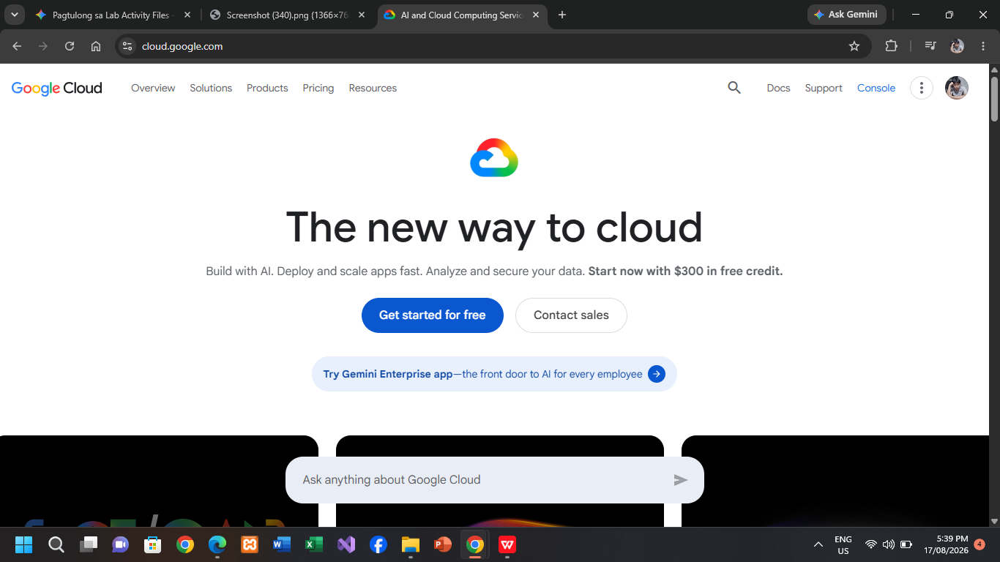

# Google Cloud Platform (GCP) Research Document

## Brief Overview
Google Cloud Platform (GCP) is a suite of cloud computing services offered by Google, built on the same internal infrastructure that Google uses for products like Google Search, YouTube, and Gmail.

## Global Infrastructure
GCP organizes infrastructure into regions and zones, linked together by Google’s high-speed private global fiber-optic network infrastructure.

## Cloud Management Console
The Google Cloud Console is an intuitive web interface for deploying, configuring, monitoring, and managing GCP services, project permissions, and service accounts.

## Core Services
1. **Compute Engine:** High-performance, customizable virtual machine instances.
2. **Cloud Storage:** Durable, globally distributed object storage.
3. **Virtual Private Cloud (VPC):** Global private networking framework connecting resources.
4. **Cloud IAM:** Granular access management and identity controls.

## Advantages
1. **Pioneer in AI and Machine Learning:** Leading AI tools, custom TPUs, and advanced data engines.
2. **Native Kubernetes Capabilities:** Premier container orchestration since Google created Kubernetes.
3. **High-Performance Global Network:** Fast internal network throughput with low latency.

## Typical Enterprise Use Cases
- High-level Artificial Intelligence and Machine Learning workloads.
- Containerized application orchestration using Google Kubernetes Engine (GKE).
- Large-scale real-time data processing and analytics using BigQuery.

